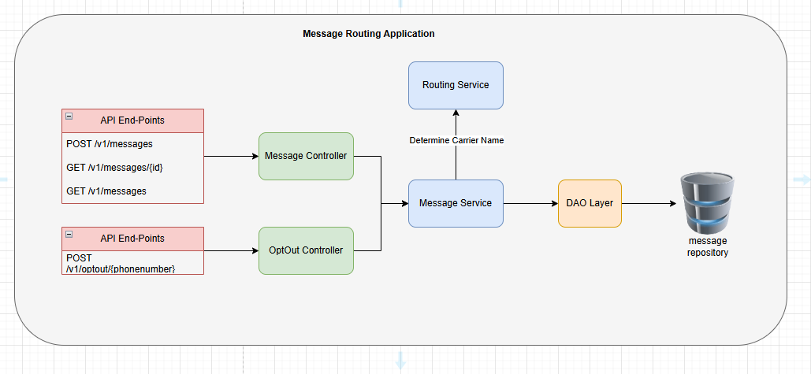
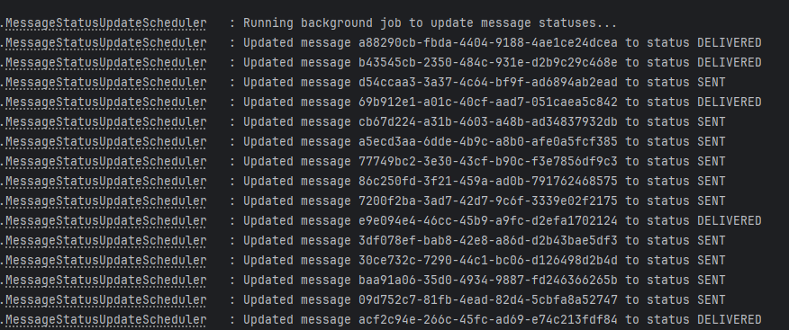

# svc-message-router

**Sinch Messaging Router Service**

This Spring Boot service provides message routing and management capabilities, including sending messages, tracking message status, and routing messages to carriers based on phone numbers.

---

## Overview

The `svc-message-router` service handles sending messages to users and routing them to the correct carrier based on country codes. It maintains message status and supports opt-out functionality.

Key components:

- **Controller** – Exposes REST APIs
- **Service Layer** – Implements business logic
- **Repository Layer** – Stores messages in-memory for demo purposes
- **Routing Service** – Determines carrier based on phone number

---

## Features

- Send messages to users
- Retrieve message by ID
- Retrieve all messages
- Opt-out management
- Carrier routing logic for AU (+61), NZ (+64), and other numbers

Routing logic for AU (+61) numbers alternates between **Telstra** and **Optus**. NZ numbers (+64) route to **Spark**, and all other numbers default to **GLOBAL**.

---

## Technologies

- Java 21
- Maven 3.6.3
- Spring Boot 4.0.2
- Spring Web & Validation
- Lombok
- JUnit 5 & Mockito (unit testing)
- ConcurrentHashMap (in-memory repository)

---

## Architecture



---

## API Endpoints

**Base URL:** `/v1`

| Method | Endpoint                | Description                            | Request | Response |
|--------|-------------------------|----------------------------------------|---------|---------|
| POST   | `/messages`             | Send a message                         | `MessageRequest` | `MessageResponse` |
| GET    | `/messages/{id}`        | Get message by ID                      | Path param: `id` | `MessageResponse` |
| GET    | `/messages`             | Get all messages                       | N/A | List of `MessageResponse` |
| POST   | `/optout/{phonenumber}` | OptOut messages for given phone number | Path param: `phonenumber` | `MessageResponse` |

**Postman collection found at `svc-message-router` folder**


--- 

**Models**

- `MessageRequest` – Contains `phoneNumber` `content` and `format`
- `MessageResponse` – Contains `id` and `status` (`PENDING`, `DELIVERED`, `BLOCKED`, `SENT`.)

---

## Swagger Specification
#### swagger.yml found at svc-message-router folder


---
## Scheduler
- `MessageStatusUpdateScheduler` is a scheduler which runs every 3 minutes at the background to update the **PENDING** messages to either **SENT** or **DELIVERED**
- Replicating real-world scenario that our application is receiving notification after message sent
- Configuration can found in application.yml file 
```config
message:
  scheduler:
    fixed-rate-ms: 180000   # 3 minutes in milliseconds (3 * 60 * 1000)
```
- And below are the logs from the application



---

## Running the Service

### Prerequisites

- Java 21
- Maven 3.x

### Build & Run

```bash
mvn clean install
mvn spring-boot:run
```

### Request API and Payloads
- `POST` Message
```curl
curl --location 'http://localhost:8080/v1/messages' \
        --header 'Content-Type: application/json' \
        --data '{
        "phoneNumber": "+61461111545",
        "content": "contect i am sefdgdsfgunding message",
        "format": "SMS"
        }'
```

- `GET` Message By Id
```curl
curl --location 'http://localhost:8080/v1/messages/77749bc2-3e30-43cf-b90c-f3e7856df9c3'
```

- `POST` OptOut Phone number
```curl
curl --location --request POST 'http://localhost:8080/v1/optout/+61461111545'
```

- `GET` All Message
```curl
curl --location 'http://localhost:8080/v1/messages'
```
